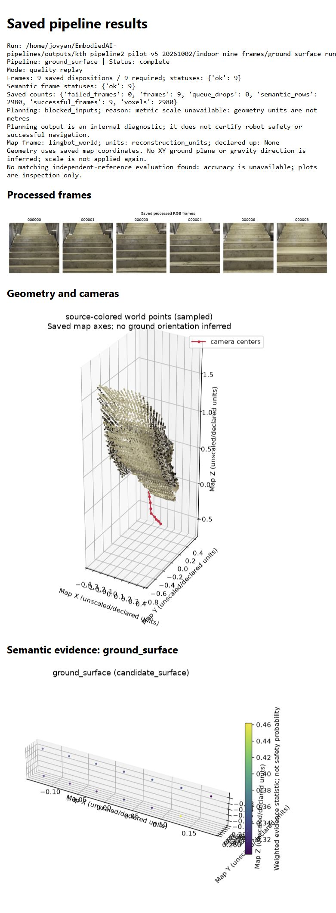
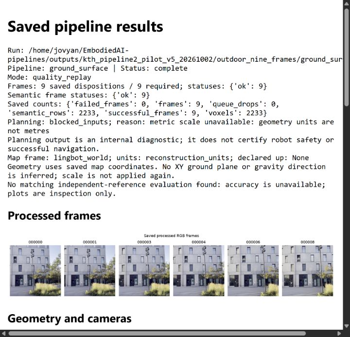
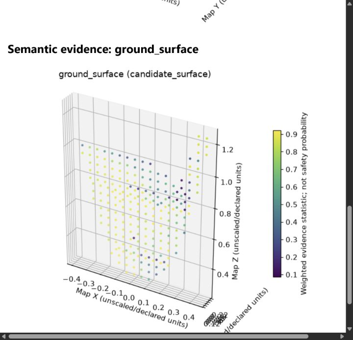

# Pipeline 2 pilot: 2 October 2026

This snapshot preserves Tomás's completed KTH pilot for teammates to inspect
before the ongoing dataset evaluation finishes. All files listed in
[manifest.json](manifest.json) are unchanged copies of locally saved evidence,
with source paths, SHA256 hashes and byte sizes. The 13 evidence/image files
total 419,012 bytes. Model inference was not rerun during repository preparation.

The original environment used Python 3.12.14, NumPy 1.26.4, Torch 2.10.0+cu126,
four CPU threads and one H100 MIG 2g.20gb device. LingBot reconstructed geometry
first; SAM then processed the saved aligned RGB/geometry cache. The records mark
both runs `fixture=false` and `models_executed=true`.

| Observation | Indoor | Outdoor |
|---|---:|---:|
| Recording | `IMG_5508.mp4` (stairway) | `IMG_5513.mp4` |
| Exact SAM prompt | `floor` | `ground` |
| Successful frames / text queries | 9 / 9 | 9 / 9 |
| Retained SAM instances | 1 | 11 |
| Map voxels / semantic evidence rows | 2,980 | 2,233 |
| Voxels with nonzero positive evidence | 13 | 227 |
| Voxels meeting evidence threshold 0.5 | 0 | 181 |
| Median SAM call | 150.30 ms | 151.02 ms |
| p95 SAM call | 336.36 ms | 349.16 ms |

The timing values come from the original [indoor](evidence/indoor_nine_frames/evaluation.json)
and [outdoor](evidence/outdoor_nine_frames/evaluation.json) evaluation reports:
nine synchronized calls per run, measured with a monotonic clock, excluding
model loading. They cannot establish live throughput, end-to-end latency or
simultaneous LingBot/SAM model fit.

The indoor result is a useful limitation example: eight successful queries
returned no instances, and the remaining positive evidence stayed below the
threshold. It is a stairway, so this is not a flat-floor accuracy benchmark.
The outdoor result illustrates stronger candidate-surface evidence. Neither
example has independent reference labels, so neither establishes segmentation
accuracy or robot safety. Scores are uncalibrated evidence statistics.

Semantic rows include observed coverage: 2,967 indoor and 2,006 outdoor rows
have zero positive weight. They must not be counted as detected surfaces.
Scale/up are unverified and no robot profile was supplied. Physical planning
is blocked; decision coverage is zero and unknown rate is one over the frozen
10,000-cell ROI. Accuracy and navigation metrics remain unavailable.

The current LingBot integration issue remains assigned to João. These
historical pilot records do not prove that the current checkout's model
integration works on every device.

## Inspect the examples

The screenshot labels retain their original unscaled map coordinates.
Complete processed images, masks, geometry/maps and interactive HTML remain
on KTH. Historical server paths in the original records are provenance, not
portable setup instructions. This directory is a metadata snapshot; it cannot
be passed to the evaluator or replay tools as a complete run.

See the [original pilot notes](../../docs/implementation/ground_surface.md)
for the recorded model/geometry checks and full experiment context. Later
results should be added as separate dated snapshots.
